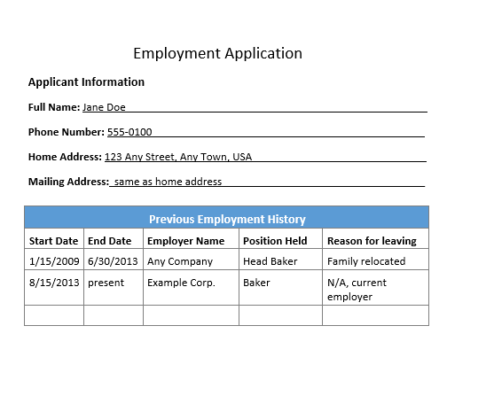

# C# .NET Core implementation

Amazon Textract samples for .NET Core with C#

## Prerequisites

- [Dotnet Core 2.2](https://dotnet.microsoft.com/download/dotnet-core/2.2)
- [AWS CLI](https://docs.aws.amazon.com/polly/latest/dg/setup-aws-cli.html) for
  running AWS CLI commands after configuring a
  [default or named profile](https://docs.aws.amazon.com/cli/latest/userguide/cli-chap-configure.html)
- Upload files from `test-files` to a target Amazon S3 bucket in your account

## Usage

```
Usage: dotnet run [--switch]
To run this console app, use the following valid switches one at a time:
                     --detect-text-local
                     --detect-text-s3
                     --pdf-text
                     --forms
                     --forms-redaction
                     --tables
                     --tables-expense
                     --reading-order
                     --nlp-comprehend
                     --nlp-medical
                     --translate
                     --search
      e.g. dotnet run --detect-text-s3
```

## Samples

| Argument            | Description                                                                                          |
| ------------------- | ---------------------------------------------------------------------------------------------------- |
| --detect-text-local | Detect text from files read from your local machine                                                  |
| --detect-text-s3    | Detect text from files read from your Amazon S3 bucket                                               |
| --pdf-text          | Detect text from a pdf document                                                                      |
| --forms             | Extract forms from a document                                                                        |
| --forms-redaction   | Reads and then redacts specified regions in the document                                             |
| --tables            | Detect tables                                                                                        |
| --tables-expense    | Detects and computes on a table                                                                      |
| --reading-order     | Detects and keeps the reading order from a two-column document                                       |
| --nlp-comprehend    | Detects text and then apply Amazon Comprehend sentiment, entities, syntax, and key phrases detection |
| --nlp-medical       | Detects text and then apply Amazon Comprehend entities and PHI detection                             |
| --translate         | Translate to a different language                                                                    |
| --search            | Index detected text using Elastic Search                                                             |

Example usage and result

```
dotnet-core sanjeet$ dotnet run --forms
default:: US West (Oregon)
........Key: Phone Number:, Value 555-0100
Key: Full Name:, Value Jane Doe
Key: Home Address:, Value 123 Any Street. Any Town, USA
Key: Mailing Address:, Value same as home address
Get Field by Key:
Key: Phone Number:, Value: 555-0100
```

The following source document was used by the example above to analyze Form
data. This document has a Form and a Table on it:



The following AWS services are used:

- Amazon Textract (for text extraction and analysis)
- Amazon Comprehend (for natural language processing)
- Amazon Comprehend Medical (for natural language processing of medical
  prescriptions/documents)
- Amazon Elasticsearch (for full text indexing and search)
- Amazon S3 (for storing scanned documents/images used by Amazon Textract)
- Amazon Translate (for translating text from English to other supported
  languages)

## Dependencies

appsettings.json file uses your default AWS profile so that you don't have to
set AWS credentials in clear text

```
{
  "AWS": {
    "Profile": "default",
    "Region": "us-west-2"
  }
}
```

### A quick walkthrough of the .csproj file

dotnet-core.csproj file: required .NET libraries - these libraries will be
auto-installed as part of the build process

```
<ItemGroup>
   <PackageReference Include="AWSSDK.Comprehend" Version="3.3.104.13" />
   <PackageReference Include="AWSSDK.ComprehendMedical" Version="3.3.100.31" />
   <PackageReference Include="AWSSDK.Extensions.NETCore.Setup" Version="3.3.100.1" />
   <PackageReference Include="AWSSDK.S3" Version="3.3.102.12" />
   <PackageReference Include="AWSSDK.Textract" Version="3.3.101.23" />
   <PackageReference Include="AWSSDK.Translate" Version="3.3.100.28" />
   <PackageReference Include="Microsoft.Extensions.Configuration" Version="2.2.0" />
   <PackageReference Include="Microsoft.Extensions.Configuration.EnvironmentVariables" Version="2.2.4" />
   <PackageReference Include="Microsoft.Extensions.Configuration.Json" Version="2.2.0" />
   <PackageReference Include="NEST" Version="6.8.0" />
   <PackageReference Include="System.Drawing.Common" Version="4.5.1" />
</ItemGroup>
```

The code sample that performs redaction on a form uses Dotnet Core
System.Drawing.Commons package. You can add System.Drawing.Common package to the
project by using the following dotnet CLI command

```
dotnet add package System.Drawing.Common --version 4.5.1
```

[NEST](https://github.com/elastic/elasticsearch-net) is the official
Elasticsearch client that's used by this sample to send text for indexing in an
Amazon Elasticsearch domain provisioned in AWS. Use the following command to
install NEST

```
dotnet add package NEST --version 6.8.0
```

AWSSDK.\* packages are Nuget client libraries, and can be installed using a
command similar to the following

```
dotnet add package AWSSDK.<package-name>
```

dotnet-core.csproj file: "test-files" folder has all the required files e.g.
pdf, jpg, and png used for testing and they are all copied to the output
directory

```
<ItemGroup>
   <None Update="appsettings.json">
   <CopyToOutputDirectory>Always</CopyToOutputDirectory>
   </None>
</ItemGroup>

<ItemGroup>
   <None Update="test-files\*">
   <CopyToOutputDirectory>Always</CopyToOutputDirectory>
   </None>
</ItemGroup>
```

To recursively copy files from local disk to S3 use the following command

```
aws s3 cp dotnet-core/test-files s3://<Your-S3-bucket>/ --include "*" --recursive
```

## Pro tips

If you ever encounter the following error while running this .NET core
application in MacOS

```
Unhandled Exception: System.TypeInitializationException: The type initializer for 'Gdip' threw an exception. ---> System.DllNotFoundException: Unable to load DLL 'libgdiplus': The specified module could not be found.
   at System.Runtime.InteropServices.FunctionWrapper`1.get_Delegate()
   at System.Drawing.SafeNativeMethods.Gdip.GdiplusStartup(IntPtr& token, StartupInput& input, StartupOutput& output)
   at System.Drawing.SafeNativeMethods.Gdip..cctor()
   --- End of inner exception stack trace ---
```

Install this package

```
brew install mono-libgdiplus
```

and if you see the following error

```
Unhandled Exception: System.ArgumentException: Parameter is not valid.
   at System.Drawing.Graphics.DrawRectangle(Pen pen, Int32 x, Int32 y, Int32 width, Int32 height)
```

ensure that the following is commented out (grpahics routine is disposed even
before it gets an opportunity to DrawRectangle that's why you get the error)

```
// graphics.Dispose();
// image.Dispose();
```
